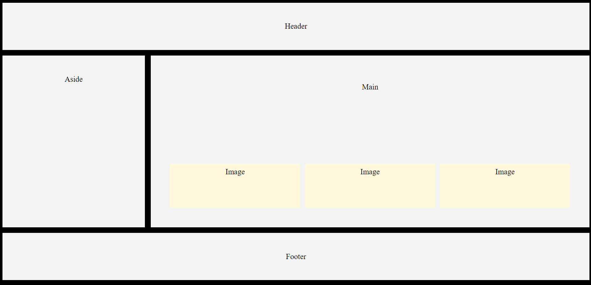

# Responsive Webpage Layout using CSS Grids

## Contents of the webpage

    1. Header Section
    2. Aside Section
    3. Main Section
        -Images
    4. Footer

## Responds to screens having max-width: 760px

## Desktop Layout

## Mobile/Tablet Layout

## How to use in your webpage

    * Clone the repository.
    * Copy the index.html and main.css file into the project folder.
    * Save it! and you are good to go!.
